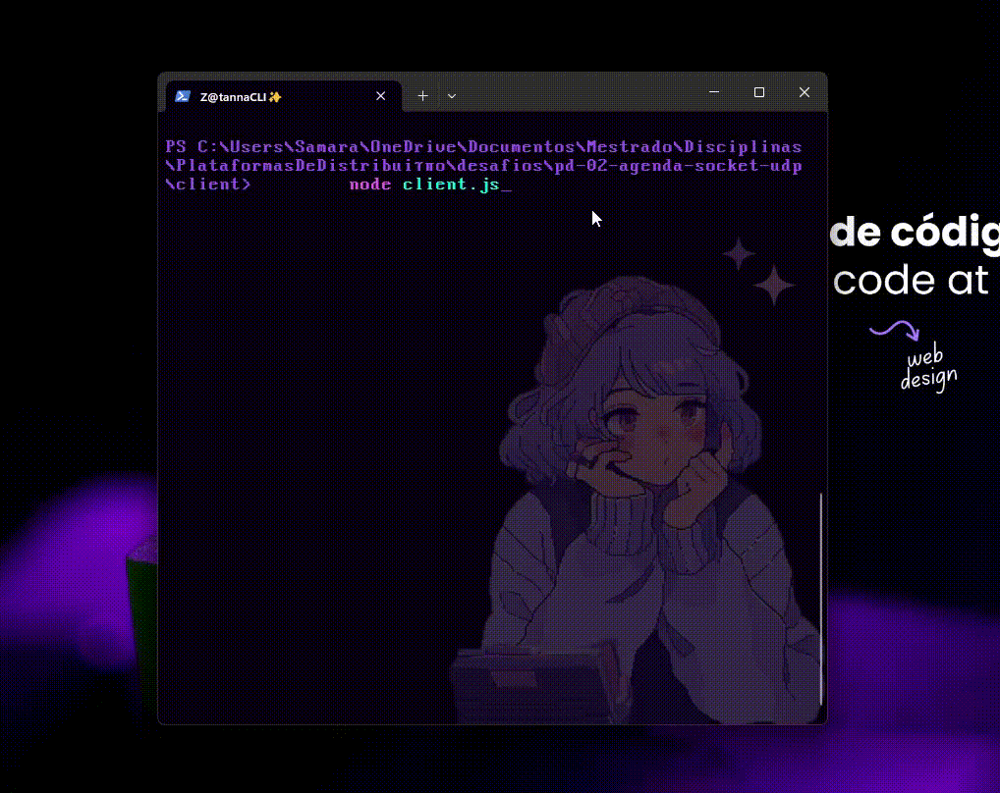

# UDP Socket Appointment Scheduler


This is an academic project developed for the **Plataformas de Distribuição UFPE, 2025.2** course, taught by Professor **Nelson Souto Rosa**. The objective was to adjust in a client-server application in Node.js to manage a real-time appointment schedule using **UDP sockets**, instead of TCP.

### Authors
* **Rodolfo Marinho:** `[armc@cin.ufpe.br]`
* **Samara Sabino:** `[sssc@cin.ufpe.br]`

## Description

This project is a client-server application built with Node.js that uses **UDP (User Datagram Protocol) sockets** to manage a real-time, shared appointment schedule. The server maintains a list of events, and multiple clients can connect to add, list, update, and remove appointments.

A key feature of the client is its **timeout mechanism**, which handles the unreliable nature of UDP by notifying the user if the server does not respond within a set time.

Appointment data is persisted to an `appointments.json` file on the server-side, ensuring that information is not lost between server restarts.

## Features

- **Stateless UDP Server**: Capable of handling datagrams from multiple clients.
- **Client-Side Timeout Logic**: Gracefully handles network uncertainty and potential packet loss by notifying the user if a server response isn't received.
- **CRUD Operations**: Clients can perform the four basic data operations:
    - **C**reate (Add)
    - **R**ead (List)
    - **U**pdate
    - **D**elete
- **Data Persistence**: The schedule is saved to a JSON file on the server.
- **Command-Line Interface**: The client provides an interactive prompt for sending commands.

## Handling UDP's Unreliability: The Timeout Logic

A core challenge of using UDP is its "fire-and-forget" nature; it offers no guarantee that a sent packet will reach its destination. A naive implementation would leave the user confused if their command was lost in transit, as the client would wait forever for a response that never comes.

To address this, we implemented a client-side timeout mechanism. This feature is not just an addition, but a direct solution to UDP's inherent unreliability, demonstrating a key concept in distributed systems: **when the transport layer (UDP) doesn't provide a feature, the responsibility moves to the application layer (our code).**

Here’s how it works in practice:



## Prerequisites

- [Node.js](https://nodejs.org/) (version 18 or higher recommended)
- [Yarn](https://yarnpkg.com/) (or another package manager like npm)

## How to Run

1.  **Clone the Repository**
    ```sh
    git clone <YOUR_REPOSITORY_URL>
    cd <YOUR_PROJECT_NAME>
    ```

2.  **Install Dependencies**
    ```sh
    yarn install
    ```

3.  **Start the Server**
    Open a terminal and run the following command. The server will start listening for connections on port 3000.
    ```sh
    node src/server/server.js
    ```
    You will see a confirmation message: `[INFO] UDP Scheduler Server started and listening on 127.0.0.1:3000`.

4.  **Start the Client**
    Open a **new** terminal (leave the server terminal running) and run the command below.
    ```sh
    node src/client/client.js
    ```
    After connecting, a `>` prompt will appear, ready to receive your commands.

## Available Commands

All commands must be entered into the client terminal. Arguments containing spaces (such as title and description) must be enclosed in double quotes (`"`).

| Command | Description | Format & Example |
| :--- | :--- | :--- |
| `ADD` | Adds a new appointment to the schedule. | **Format:**<br>`ADD <date> <time> <duration_min> "<title>" "[optional_description]"`<br><br>**Example:**<br>```> ADD 2025-10-26 15:00 90 "Project Sync" "Discuss milestones"``` |
| `LIST` | Lists all appointments or filters by a specific date. | **Format:**<br>`LIST` or `LIST <date>`<br><br>**Example:**<br>```> LIST\n> LIST 2025-10-26``` |
| `UPDATE` | Updates a specific field of an existing appointment, identified by its `id`.<br><br>**Updatable fields:**<br>`date`, `time`, `duration`, `title`, `description`. | **Format:**<br>`UPDATE <id> <field> "<new_value>"`<br><br>**Example:**<br>```> UPDATE 1 title "General Project Sync Meeting"``` |
| `DELETE` | Removes an appointment from the schedule, identified by its `id`. | **Format:**<br>`DELETE <id>`<br><br>**Example:**<br>```> DELETE 2``` |

## Concurrency & Resilience Testing

To validate the server's ability to handle multiple simultaneous clients and ensure the client's timeout logic is robust, a dedicated concurrency testing suite was developed.

This suite automatically simulates various real-world scenarios, runs a battery of tests, and generates a detailed `report.json` file, providing a clear overview of the system's performance and stability under pressure.

### How to Run the Tests

The test suite runs independently of the main server and client.

1.  **Navigate to the Test Directory**
    ```sh
    cd test
    ```

2.  **Execute the Test Script**
    Run the main test client, which will orchestrate all scenarios automatically.
    ```sh
    node test_client_auto.js
    ```

The script will display real-time logs in the terminal for all simulated users and server interactions. Upon completion, a final report will be shown on the screen, and a detailed `report.json` file will be generated in the `test` directory.

### Test Scenarios Explained

The suite executes 30 tests distributed across three distinct scenarios, each designed to validate a specific aspect of the system.

#### Scenario 1: Stable Server & Normal Load
* **Goal:** To verify that the server can correctly handle standard CRUD operations from multiple concurrent users without data corruption or errors.
* **Execution:** 10 simulated users connect at the same time. Each user performs a sequence of `ADD`, `LIST`, `UPDATE`, and `DELETE` commands.
* **Expected Outcome:** All operations must be processed correctly by the server, and all 10 user tests should pass.

#### Scenario 2: Server Crash Simulation
* **Goal:** To test the client's resilience and timeout mechanism when the server fails unexpectedly *during* operations.
* **Execution:** The test server is programmed to shut down after receiving the first 3 commands. Immediately, 10 users attempt to send commands.
* **Expected Outcome:** The first few commands will succeed, causing the server to crash. All subsequent commands from all clients **must** result in a timeout. A user's test is considered successful if it correctly identifies this timeout. All 10 user tests should pass.

#### Scenario 3: Server Offline Simulation
* **Goal:** To validate the client's timeout logic when the server is unavailable from the start.
* **Execution:** 10 users attempt to send commands, but the server process is never started.
* **Expected Outcome:** Every command from every client must fail with a timeout. A user's test is considered successful if it correctly handles this initial timeout. All 10 user tests should pass.

<br>
<div style="text-align: center; font-family: monospace; white-space: pre;">
  <a href="https://git.io/typing-svg">
    
  </a>
</div>